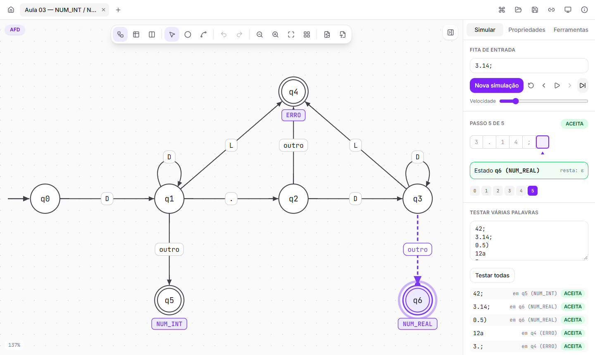
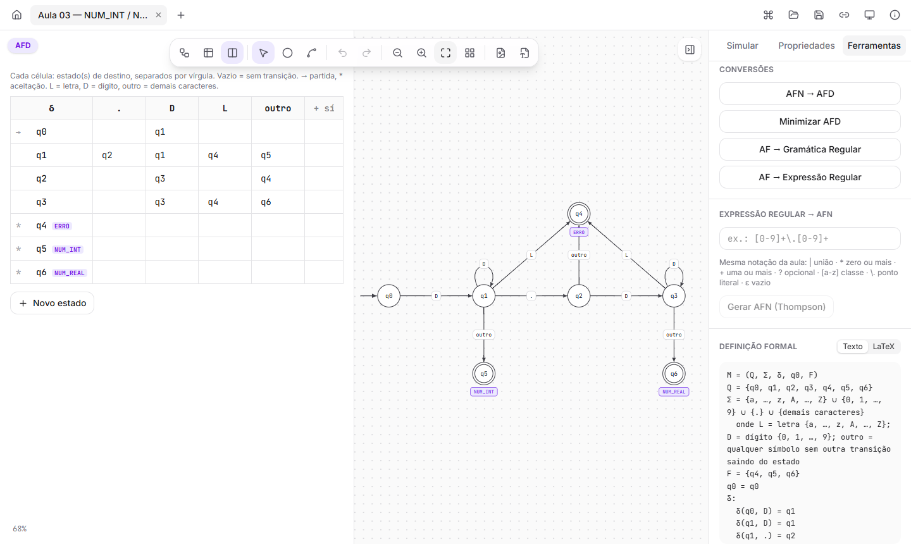
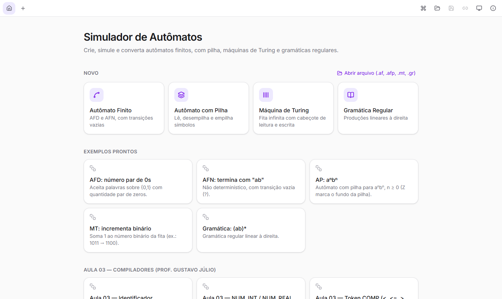
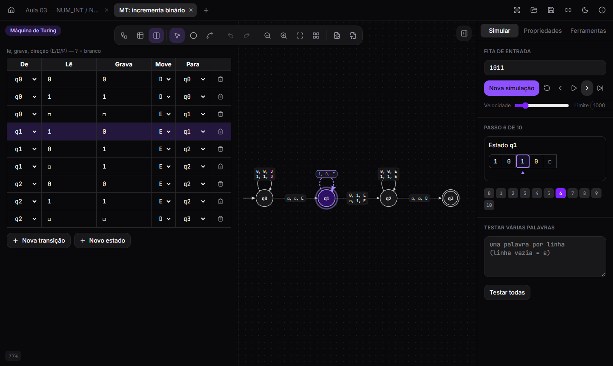

# Simulador de Autômatos

Crie, simule e converta **autômatos finitos, autômatos com pilha, máquinas de Turing e gramáticas regulares** direto no navegador.

É uma versão web e moderna do antigo *Simulador de Autômatos* (Delphi/Windows) usado nas disciplinas de **Compiladores** e **Linguagens Formais**. Tem as mesmas funcionalidades, com cara de ferramenta de diagramação atual, e já vem com os exemplos das aulas.



---

## O que dá para fazer

### Desenhar
- **Editor visual**: duplo clique cria um estado. Para criar uma transição, arraste da borda de um estado até outro. Laços, estado de partida e estados de aceitação (círculo duplo) são suportados.
- **Rótulos nos estados**, como nos slides: `ERRO`, `NUM_INT`, `NUM_REAL`…
- **Tabela de transições** editável e sincronizada com o diagrama. Dá para ver só o diagrama, só a tabela ou os dois lado a lado.
- Desfazer/refazer, zoom, organização automática do layout, seleção por caixa e exportação em **PNG/SVG**.

### Simular
- **Passo a passo** ou tudo de uma vez, com animação: o estado ativo acende, um ponto percorre a transição usada, o cabeçote desliza na fita e a pilha empilha e desempilha.
- **Não determinismo de verdade**: no AFN, todos os ramos são acompanhados ao mesmo tempo (incluindo o fecho-ε). No autômato com pilha e na máquina de Turing, as configurações são exploradas em largura, com limite de passos.
- **Linha do tempo clicável**: dá para voltar a qualquer passo.
- **Testar várias palavras de uma vez**, vendo em que estado cada uma terminou (ex.: `42;` → q5 NUM_INT).
- Resultado claro: **ACEITA**, **REJEITA** ou **Limite de passos atingido**.

### Converter e analisar
- AFN → AFD (construção de subconjuntos)
- Minimização de AFD, mostrando as partições de cada rodada
- Autômato finito ↔ gramática regular
- Expressão regular → AFN (Thompson) e autômato finito → expressão regular (eliminação de estados)
- **Definição formal** M = (Q, Σ, δ, q0, F) em texto e em **LaTeX**, pronta para copiar
- **Validação em tempo real**: estados inalcançáveis, estados mortos, falta de estado de partida, transições faltando no AFD, e o selo **AFD/AFN** automático



### Salvar e compartilhar
- Arquivos `.af` (finito), `.afp` (pilha), `.mt` (Turing) e `.gr` (gramática), com as mesmas extensões do programa original
- Salvamento automático no navegador e vários documentos abertos em abas
- **Link de compartilhamento**: o autômato vai dentro do próprio link, e quem abrir vê exatamente o que você fez

---

## Notação

O simulador segue a notação usada em aula.

### Nas transições

| Você escreve | Significa |
|---|---|
| `a`, `0`, `+`, `.` | o próprio caractere |
| `?` | transição vazia (ε/λ); na máquina de Turing, o símbolo branco |
| `L` (ou `letra`) | qualquer letra, `a`–`z` e `A`–`Z` |
| `D` (ou `dígito`) | qualquer dígito, `0`–`9` |
| `outro` | qualquer caractere que **não** tenha outra transição saindo daquele estado |
| `[a-zA-Z0-9]` | classe de caracteres |
| `\L` | a letra L literal (idem `\D`, `\?`) |

| Tipo | Formato do rótulo | Exemplo |
|---|---|---|
| Autômato finito | símbolos separados por vírgula | `L, D` |
| Autômato com pilha | lido, topo da pilha, empilha | `a, Z, AZ` |
| Máquina de Turing | lido, gravado, direção (E/D/P) | `0, 1, D` |

### Expressões regulares (mesma notação do Flex)

| Operador | Significado | Exemplo |
|---|---|---|
| `\|` | união | `a\|b` |
| `*` | zero ou mais | `a*` |
| `+` | uma ou mais | `[0-9]+` |
| `?` | opcional | `-?[0-9]+` |
| `[ ]` | classe | `[a-zA-Z_]` |
| `\.` | caractere literal | `[0-9]+\.[0-9]+` |
| `{outro}` | símbolo nomeado | `L(L\|D)*{outro}` |
| `ε` | palavra vazia | `a\|ε` |

Precedência, da maior para a menor: parênteses → `*` `+` `?` → concatenação → `|`. Ou seja, `ab*|c` = `(a(b*))|c`.

### Gramáticas regulares

Uma linha por variável, linear à direita:

```
S -> aA | b | ?
A -> bS
```

A primeira variável é o símbolo inicial, e `?` é a palavra vazia.

---

## Exemplos prontos

A tela inicial já traz:

- **Clássicos**: AFD de número par de 0s, AFN que termina com "ab", autômato com pilha para aⁿbⁿ, máquina de Turing que incrementa um número binário, e uma gramática.
- **Aula 03 de Compiladores**: identificador, NUM_INT / NUM_REAL (com o estado de ERRO), token COMP (`<`, `<=`, `>`, `>=`), `a(b|c)*`, `ab*|c` e número real. Todos seguem o desenho dos slides e já vêm com palavras de teste reais, como `soma;`, `3.14;` e `<=`.



---

## Atalhos

| Atalho | Ação |
|---|---|
| `V` / `S` / `T` | selecionar e mover / criar estado / criar transição |
| Duplo clique | no vazio cria um estado; no rótulo, edita |
| Botão direito | partida, aceitação, rótulo, renomear, inverter, excluir |
| `Delete` | excluir a seleção |
| `Ctrl+Z` / `Ctrl+Y` | desfazer / refazer |
| `Ctrl+S` / `Ctrl+O` | salvar / abrir arquivo |
| `Ctrl+K` | paleta de comandos (todas as ações, com busca) |
| `Espaço` + arrastar, roda do mouse | mover a visão e dar zoom |

O tema claro e o escuro seguem o sistema, e dá para trocar no ícone do topo.



---

## Rodando o projeto

Precisa do [Node.js](https://nodejs.org) 20.19 ou mais recente.

```bash
npm install
npm run dev        # abre em http://localhost:5173
```

| Comando | O que faz |
|---|---|
| `npm test` | roda os testes da lógica (Vitest) |
| `npm run coverage` | testes com relatório de cobertura |
| `npm run build` | gera a versão de produção em `dist/` |
| `npm run preview` | serve a versão de produção localmente |

### Publicando na Vercel

É um site estático, sem servidor. Em [vercel.com](https://vercel.com), escolha *Add New → Project*, importe este repositório e clique em *Deploy*. A Vercel reconhece o Vite sozinha.

---

## Como funciona por dentro

Tudo roda no navegador. Não existe backend.

```
src/
├── core/          lógica pura, sem React, coberta por testes
│   ├── types.ts       modelo: estados, transições, autômatos, gramáticas
│   ├── model.ts       edição (criar, renomear, inverter…) e leitura de rótulos
│   ├── symbols.ts     notação das aulas: L, D, outro, classes
│   ├── sim.ts         simulação (AF por conjuntos de estados; AP e MT por busca em largura)
│   ├── analyze.ts     validação e detecção de AFD/AFN
│   ├── convert.ts     AFN → AFD e minimização
│   ├── regex.ts       parser de ER, Thompson e eliminação de estados
│   ├── grammar.ts     parser de gramática e conversões AF ↔ GR
│   ├── formal.ts      definição formal em texto e LaTeX
│   └── io/            arquivos, link compartilhável e importador do programa antigo
├── components/    interface: canvas SVG, painéis, tabela, paleta de comandos
└── store.ts       documentos abertos, desfazer/refazer e salvamento automático
```

- **Simulação**: gera de uma vez todos os passos (os *frames*). É isso que permite voltar e avançar na linha do tempo e destacar o caminho que levou à aceitação.
- **Conversões**: cada uma é testada comparando o autômato original com o convertido em todas as palavras até um certo tamanho. Os dois precisam aceitar exatamente as mesmas.
- **Tecnologias**: Vite, React, TypeScript e Tailwind CSS. O diagrama é SVG feito à mão. Também usa Radix UI (menus e dicas), Motion (animações), Zustand (estado) e lz-string (links compartilháveis).

---

## Limitações conhecidas

- **Conversões com a notação das aulas**: nas conversões (AFN→AFD, minimização, ER, gramática), `L`, `D` e `outro` são tratados como um símbolo cada, do jeito que aparecem no desenho.
- **Arquivos do programa antigo**: ainda não abrem. Eles usam um formato binário do Delphi, e o importador precisa de arquivos de exemplo para ser feito.
- **Planejado**: instalação como app (PWA), modo apresentação e compatibilidade com o JFLAP.

---

## Créditos

- Inspirado no *Simulador de Autômatos* original (Delphi), usado nas aulas de Compiladores.
- Exemplos baseados na **Aula 03 — Expressões Regulares, Autômatos e Lex/Flex**, de Compiladores (Univértix).

---

## Licença

[MIT](LICENSE): pode usar, copiar, modificar e distribuir o código livremente, desde que mantenha o aviso de autoria.
